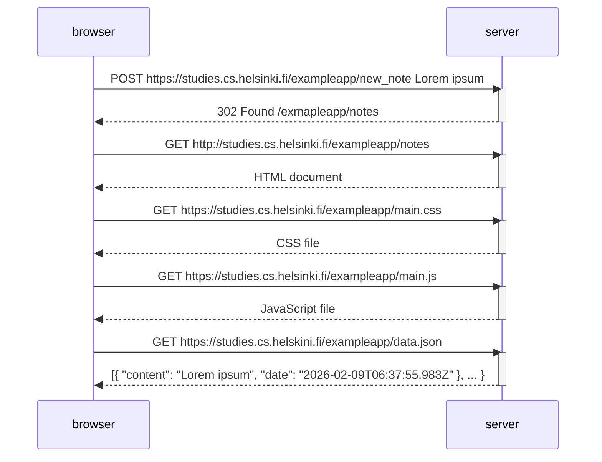

```mermaid
sequenceDiagram
    participant browser
    participant server

    browser->>server: POST https://studies.cs.helsinki.fi/exampleapp/new_note Lorem ipsum
    activate server
    server-->>browser: 302 Found /exmapleapp/notes
    deactivate server

    browser->>server: GET http://studies.cs.helsinki.fi/exampleapp/notes
    activate server
    server-->>browser: HTML document
    deactivate server

    browser->>server: GET https://studies.cs.helsinki.fi/exampleapp/main.css
    activate server
    server-->>browser: CSS file
    deactivate server

    browser->>server: GET https://studies.cs.helsinki.fi/exampleapp/main.js
    activate server
    server-->>browser: JavaScript file
    deactivate server

    browser->>server: GET https://studies.cs.helskini.fi/exampleapp/data.json
    activate server
    server-->>browser: [{ "content": "Lorem ipsum", "date": "2026-02-09T06:37:55.983Z" }, ... }
    deactivate server
```
